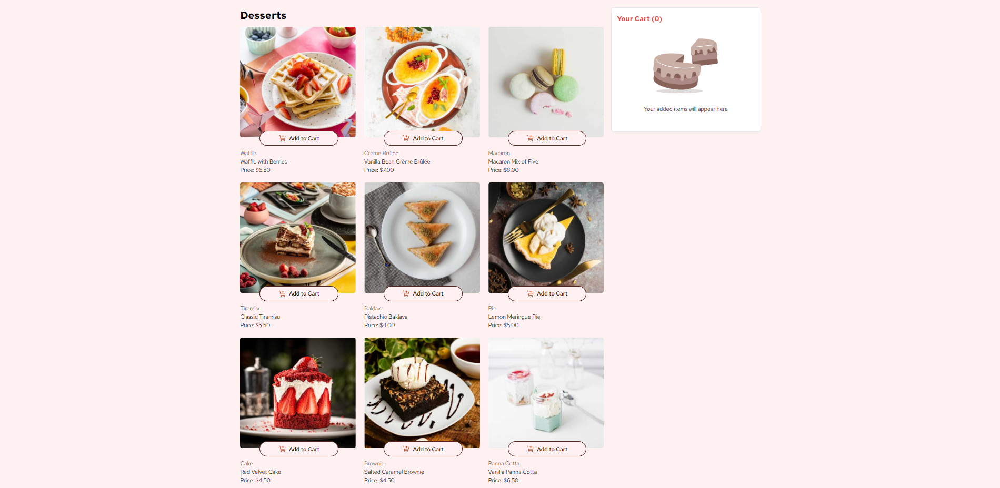

## Welcome! 👋

## Table of contents

- [Welcome! 👋](#welcome-)
- [Table of contents](#table-of-contents)
- [Overview](#overview)
  - [The challenge](#the-challenge)
  - [Screenshot](#screenshot)
  - [Links](#links)
  - [Built with](#built-with)
  - [What I learned](#what-i-learned)
  - [Continued development](#continued-development)
  - [Useful resources](#useful-resources)
- [Author](#author)

## Overview

### The challenge

Users should be able to:

- Add items to the cart and remove them
- Increase/decrease the number of items in the cart
- See an order confirmation modal when they click "Confirm Order"
- Reset their selections when they click "Start New Order"
- View the optimal layout for the interface depending on their device's screen size
  
### Screenshot

### Links

- Live Site URL: [product-cart](https://product-cart-ten-mauve.vercel.app/)

### Built with

- Semantic HTML5 markup
- React vite
- tailwindcss
- Javascript
- Flexbox
- CSS Grid
- Mobile-first workflow

### What I learned

Throughout this project, I gained a deep understanding of responsive design and how to optimize layouts for various breakpoints. I worked extensively with CSS Grid and Flexbox, leveraging their capabilities to create efficient, adaptive, and visually appealing layouts. Additionally, I enhanced my React skills by utilizing useState and React Hooks to manage state and handle component lifecycle events effectively. I also explored the React Context API for state management, enabling me to share global state across components in a clean and efficient manner.

Moreover, I developed a strong understanding of Props and functional JavaScript, which allowed me to build dynamic, reusable components. I implemented functionality for adding, removing, and updating items in a product cart, ensuring smooth user interactions and state updates. This experience has solidified my understanding of how to manage state efficiently in React applications while maintaining clarity and performance.

### Continued development

In future projects, I will continue to deepen my expertise in React, particularly in managing and updating component states efficiently. I plan to focus on improving my understanding of advanced state management techniques, including using hooks and the Context API for complex applications. Additionally, I aim to further enhance my knowledge of functional JavaScript, with an emphasis on writing clean, modular, and scalable code. By mastering these areas, I aim to build more dynamic and performant applications that can handle increasingly complex user interactions and data flow.

### Useful resources

I have used tools like ChatGPT for code modification and testing, which will help me refine my coding practices and improve my problem-solving skills. By using AI-assisted tools, I aim to accelerate the debugging process and enhance my ability to write efficient, clean code. Additionally, I plan to regularly visit the official React documentation at react.org to stay updated with best practices, deepen my understanding of React concepts, and ensure that my knowledge remains current. This continuous learning will support my goal of developing high-quality, scalable applications.

## Author

- Github - [@Akash-dev-lab](https://github.com/Akash-dev-lab)
- Frontend Mentor - [@Akash-dev-lab](https://www.frontendmentor.io/profile/Akash-dev-lab)
